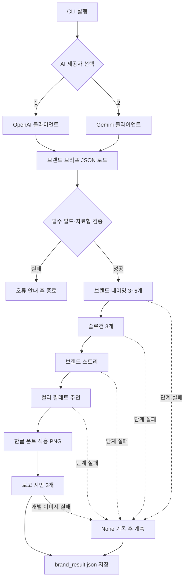
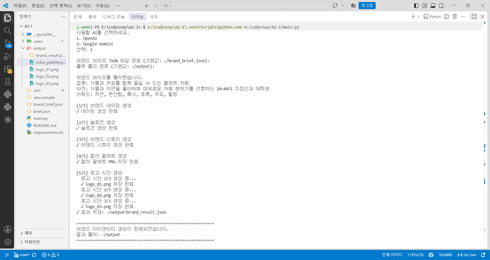
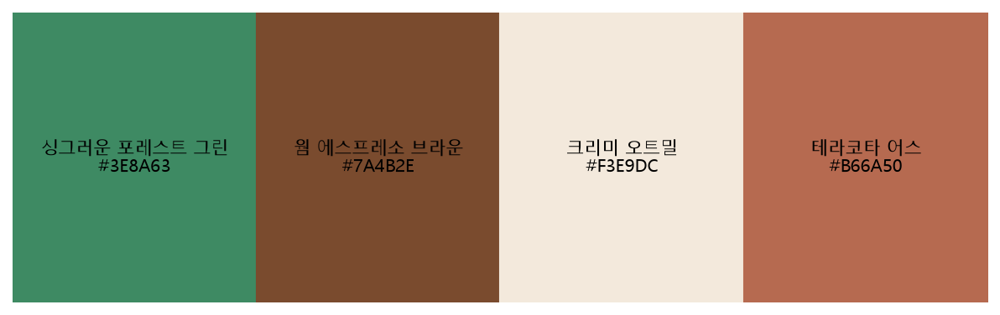
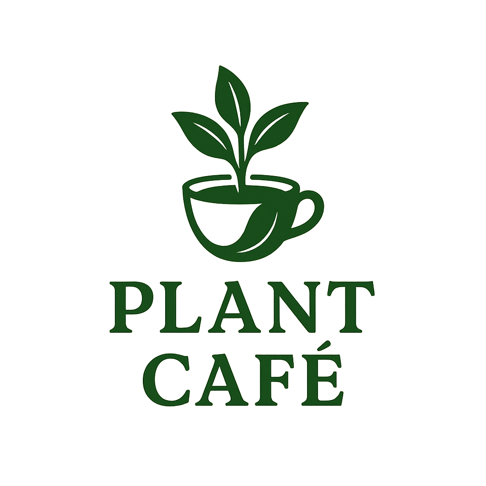
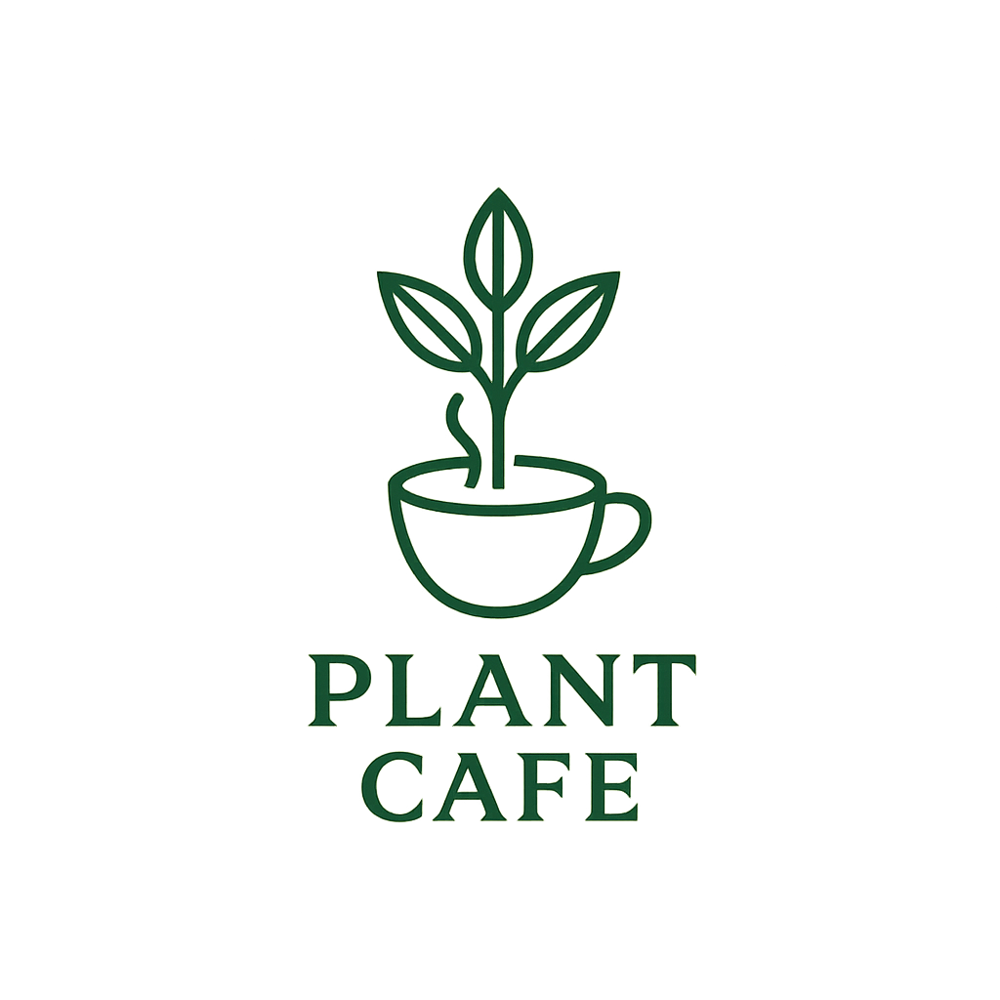

# AI Brand Identity Generator

> **Codyssey A2-1 · Term Project A**  
> 하나의 브랜드 브리프를 입력하면 OpenAI 또는 Google Gemini가 브랜드 네이밍, 슬로건, 스토리, 컬러 팔레트와 로고 시안까지 생성하고 JSON·PNG 파일로 저장하는 CLI 프로그램입니다.

<p align="center">
  
  
  
  
  
</p>

---

## Summary

| 구분 | 내용 |
|---|---|
| 해결한 문제 | 브랜드 기획에 필요한 텍스트와 시각 요소를 각각 제작해야 하는 문제 |
| 구현 형태 | Python 대화형 CLI 기반 브랜드 아이덴티티 생성기 |
| 입력 | AI 제공자 선택 + 브랜드 브리프 JSON + 출력 폴더 |
| 핵심 흐름 | 브리프 검증 → 네이밍 → 슬로건 → 스토리 → 컬러 팔레트 → 로고 시안 |
| 지원 AI | OpenAI / Google Gemini |
| 텍스트 결과 | 브랜드명 3~5개, 슬로건 3개, 약 300자 스토리, 컬러 정보 |
| 이미지 결과 | 컬러 팔레트 1개 + 로고 시안 3개 |
| 최종 결과물 | `brand_result.json`, `color_palette.png`, `logo_01~03.png` |
| 안정성 | 단계별 예외 처리, 부분 실패 시 다음 단계 계속 진행 |
| 최근 보완 | 브리프 경로 기본값, 컬러 팔레트 한글 폰트 적용 |

### 바로가기

- [프로젝트 개요](#overview)
- [문제와 해결 방법](#problem--solution)
- [처리 흐름](#architecture)
- [핵심 기능](#features)
- [실행 및 결과 화면](#screenshots)
- [실행 방법](#how-to-run)
- [입력 파일](#brand-brief)
- [테스트](#testing)
- [공식 미션 요구사항](#공식-미션-요구사항-체크리스트)
- [오류 해결과 변경 이력](#troubleshooting--changes)
- [팀 역할](#team)

---

# Overview

브랜드 아이덴티티를 설계하려면 이름, 슬로건, 스토리, 색상과 로고를 하나의 방향으로 구성해야 합니다. 이 프로젝트는 업종, 타겟, 키워드, 톤앤매너 등을 JSON 브리프로 정의하고, 선택한 생성형 AI가 필요한 브랜드 요소를 자동으로 제안하도록 구성했습니다.

사용자는 실행 시 OpenAI와 Google Gemini 중 하나를 선택할 수 있습니다. 프로그램은 동일한 브랜드 브리프를 바탕으로 텍스트 요소를 구조화된 JSON으로 생성하고, 추천된 색상을 Matplotlib 이미지로 시각화합니다. 마지막으로 이미지 생성 모델을 호출해 로고 시안 3개를 PNG로 저장합니다.

## What We Built

1. **Interactive CLI**
   - `print()`와 `input()`을 이용한 대화형 실행
   - OpenAI 또는 Google Gemini 선택
   - 브리프와 출력 폴더 경로의 기본값 제공

2. **Validated Brand Brief**
   - JSON 파일 기반 브랜드 정보 입력
   - `industry`, `target`, `keywords` 필수 필드 검증
   - `keywords` 배열 형식 검증

3. **AI Brand Text Generation**
   - 의미와 추천 이유를 포함한 브랜드명 3~5개
   - 톤앤매너에 맞는 슬로건 3개
   - 탄생 배경, 철학, 비전을 담은 약 300자 스토리
   - 메인 1개와 서브 2~3개의 HEX 컬러 추천

4. **Visual Asset Generation**
   - Matplotlib 기반 컬러 팔레트 PNG 저장
   - 한글 색상명 렌더링을 위한 Windows 글꼴 설정
   - 이미지 생성 API 기반 로고 시안 3개 저장

5. **Result Persistence & Error Handling**
   - 모든 텍스트 결과를 하나의 JSON으로 저장
   - 각 API 단계를 독립적인 `try-except`로 처리
   - 한 단계가 실패해도 가능한 다음 단계 계속 진행

## Tech / Tools

| 영역 | 사용 기술 | 역할 |
|---|---|---|
| Language | Python 3.11.15 | 전체 CLI 프로그램 구현 및 테스트 |
| LLM | OpenAI `gpt-5-mini` | 네이밍, 슬로건, 스토리, 컬러 생성 |
| Image | OpenAI `gpt-image-1` | 로고 시안 생성 |
| LLM | Google `gemini-2.5-flash` | 선택 가능한 텍스트 생성 경로 |
| Image | Google `gemini-2.5-flash-image` | 선택 가능한 로고 생성 경로 |
| Configuration | python-dotenv | API 키 환경변수 로드 |
| Visualization | Matplotlib | 컬러 팔레트 PNG 생성 |
| Data | JSON | 브랜드 브리프 입력 및 결과 저장 |
| Editor | Visual Studio Code | 개발, 디버깅, 실행 확인 |

---

# Problem & Solution

## Problem

브랜드 디자인은 서로 다른 형태의 결과물을 함께 기획해야 하는 작업입니다.

- 자연어 결과를 그대로 사용하면 출력 형식이 매번 달라질 수 있습니다.
- 컬러 HEX 코드만으로는 실제 색의 조화를 바로 확인하기 어렵습니다.
- 텍스트 생성 API와 이미지 생성 API는 서로 다른 응답 구조를 사용합니다.
- API 키, 권한, 쿼터 또는 네트워크 문제로 일부 단계만 실패할 수 있습니다.
- Matplotlib의 기본 글꼴은 Windows 환경에서 한글이 네모로 표시될 수 있습니다.

## Solution

| 문제 | 해결 방법 |
|---|---|
| 입력 형식 불일치 | 필수·선택 필드를 가진 브랜드 브리프 JSON 사용 |
| AI 응답 파싱 | JSON 형식 응답을 요청하고 코드 블록을 제거한 뒤 파싱 |
| 색상 확인 어려움 | HEX 코드를 Matplotlib 컬러 블록으로 변환 |
| 한글 글꼴 깨짐 | 맑은 고딕 또는 나눔고딕을 탐색해 Matplotlib에 적용 |
| 제공자별 API 차이 | OpenAI와 Gemini 호출 로직을 `ai_choice`로 분기 |
| 부분 실패 | 각 생성 단계를 개별 예외 처리하고 최종 JSON 저장 |
| 반복 경로 입력 | `./brand_brief.json`, `./output` 기본값 제공 |

---

# Architecture



## Provider별 모델 흐름

```text
OpenAI 선택
  ├─ 텍스트: gpt-5-mini
  └─ 이미지: gpt-image-1

Google Gemini 선택
  ├─ 텍스트: gemini-2.5-flash
  └─ 이미지: gemini-2.5-flash-image
```

두 경로 모두 같은 브리프 스키마와 출력 파일 구조를 사용합니다.

---

# Features

## 1. AI 제공자 선택

```text
사용할 AI를 선택하세요.
1. OpenAI
2. Google Gemini
선택:
```

선택값이 `1` 또는 `2`가 아니면 올바른 값을 입력할 때까지 다시 요청합니다. 선택한 제공자에 필요한 API 키가 없으면 어떤 환경변수를 확인해야 하는지 안내하고 종료합니다.

## 2. 브랜드 브리프 기본 경로

```text
브랜드 브리프 JSON 파일 경로 (기본값: ./brand_brief.json):
출력 폴더 경로 (기본값: ./output):
```

두 질문 모두 Enter만 누르면 프로젝트에 포함된 `brand_brief.json`을 읽고 `output/`에 결과를 저장합니다. 별도의 JSON이나 출력 폴더를 사용하려면 상대경로나 절대경로를 입력할 수 있습니다.

## 3. 구조화된 텍스트 생성

| 단계 | 생성 결과 | 형식 |
|---|---|---|
| 네이밍 | 후보 3~5개, 의미, 추천 이유 | JSON 객체 배열 |
| 슬로건 | 짧고 기억하기 쉬운 문구 3개 | JSON 문자열 배열 |
| 스토리 | 탄생 배경, 철학, 비전을 포함한 약 300자 | JSON 문자열 |
| 컬러 | 메인 1개, 서브 2~3개, HEX, 추천 이유 | JSON 객체 |

AI가 Markdown 코드 블록을 포함해 응답하는 경우 이를 제거하고, 첫 번째 `{`부터 마지막 `}`까지 다시 추출해 JSON 변환을 시도합니다.

## 4. 컬러 팔레트 시각화

컬러 응답의 메인·서브 색상을 하나의 가로형 PNG로 구성합니다. 각 영역에는 한글 색상명과 HEX 코드를 함께 표시합니다.

Windows 환경에서는 다음 글꼴을 순서대로 탐색합니다.

1. `C:/Windows/Fonts/malgun.ttf`
2. `C:/Windows/Fonts/NanumGothic.ttf`

사용 가능한 글꼴을 Matplotlib 전역 글꼴로 적용해 한글 글리프 누락 문제를 해결했습니다.

## 5. 로고 시안 생성

브랜드의 업종, 타겟, 키워드, 톤앤매너, 추가 요청사항을 이미지 생성 프롬프트로 전달하고 로고 시안 3개를 생성합니다.

```text
logo_01.png
logo_02.png
logo_03.png
```

각 이미지 생성은 독립적으로 처리하므로 특정 시안이 실패해도 나머지 시안 생성을 계속 시도합니다.

## 6. 결과 JSON 저장

```json
{
  "brand_names": {
    "brand_names": []
  },
  "slogans": {
    "slogans": []
  },
  "brand_story": {
    "brand_story": "..."
  },
  "color_palette": {
    "main": {},
    "sub": []
  },
  "logo_files": [
    "logo_01.png",
    "logo_02.png",
    "logo_03.png"
  ]
}
```

텍스트 생성에 실패한 단계는 `null`로 기록됩니다. 이를 통해 일부 API 호출이 실패해도 성공한 결과는 보존할 수 있습니다.

---

# CLI Demo

```text
============================================================
             브랜드 아이덴티티 생성기
============================================================

사용할 AI를 선택하세요.
1. OpenAI
2. Google Gemini
선택: 1

브랜드 브리프 JSON 파일 경로 (기본값: ./brand_brief.json):
출력 폴더 경로 (기본값: ./output):

브랜드 브리프를 불러왔습니다.

[1/5] 브랜드 네이밍 생성
✓ 네이밍 생성 완료

[2/5] 슬로건 생성
✓ 슬로건 생성 완료

[3/5] 브랜드 스토리 생성
✓ 브랜드 스토리 생성 완료

[4/5] 컬러 팔레트 생성
✓ 컬러 팔레트 PNG 저장 완료

[5/5] 로고 시안 생성
  ✓ logo_01.png 저장 완료
  ✓ logo_02.png 저장 완료
  ✓ logo_03.png 저장 완료
✓ 결과 저장: ./output\brand_result.json
```

---

# Screenshots

## 전체 기능 정상 실행

브리프 기본 경로와 출력 폴더 기본값을 사용하고, OpenAI를 통해 텍스트 요소와 컬러 팔레트, 로고 시안 3개를 생성한 결과입니다.

<p align="center">
  
</p>

## 컬러 팔레트

<p align="center">
  
</p>

## 로고 시안

<p align="center">
  
  
  
</p>

> 이미지 생성 결과는 선택한 제공자, 모델, 입력 브리프와 실행 시점에 따라 달라질 수 있습니다.

---

# Project Structure

```text
codyssey_term2_project/
├── assets/
│   └── images/
│       ├── 코디세이_A2-1_실행화면_최종기능구현_260821.png
│       ├── color_palette.png
│       ├── logo_01.png
│       ├── logo_02.png
│       └── logo_03.png
├── output/                       # 실행 시 생성
│   ├── brand_result.json
│   ├── color_palette.png
│   ├── logo_01.png
│   ├── logo_02.png
│   └── logo_03.png
├── .env                          # 로컬 전용, 커밋 금지
├── .env.sample
├── brand_brief.json
├── main.py
├── README.md
└── requirements.txt
```

> `.env`, `.venv/`, `__pycache__/`, `output/`은 로컬 실행 과정에서 사용하거나 생성되는 항목입니다. API 키가 포함된 `.env`는 절대 저장소에 커밋하지 않습니다.

---

# How to Run

## 1. 저장소 복제 및 이동

```powershell
git clone https://github.com/byeongchan/codyssey_term2_project.git
cd codyssey_term2_project
```

## 2. 가상환경 생성 및 활성화

```powershell
python -m venv .venv
```

```powershell
.\.venv\Scripts\Activate.ps1
```

PowerShell 실행 정책으로 활성화가 제한되면 현재 터미널에만 다음 설정을 적용한 뒤 다시 활성화합니다.

```powershell
Set-ExecutionPolicy -Scope Process -ExecutionPolicy RemoteSigned
```

가상환경을 활성화하지 않고 직접 실행할 수도 있습니다.

```powershell
.\.venv\Scripts\python.exe .\main.py
```

## 3. 패키지 설치

```powershell
python -m pip install -r requirements.txt
```

## 4. API 키 설정

`.env.sample`을 복사해 프로젝트 루트에 `.env`를 만듭니다.

```powershell
Copy-Item .env.sample .env
```

사용하려는 제공자의 키를 입력합니다.

```dotenv
OPENAI_API_KEY=YOUR_OPENAI_API_KEY
GEMINI_API_KEY=YOUR_GEMINI_API_KEY
```

- OpenAI를 선택할 때는 `OPENAI_API_KEY`가 필요합니다.
- Google Gemini를 선택할 때는 `GEMINI_API_KEY`가 필요합니다.
- 한 제공자만 사용할 경우 다른 키는 비워둘 수 있습니다.
- 서로 다른 제공자의 키를 바꾸어 입력하지 않도록 주의합니다.
- 실제 키를 README, 캡처, 채팅 또는 Git 커밋에 포함하지 않습니다.

## 5. 브랜드 브리프 작성

기본 제공되는 `brand_brief.json`을 수정하거나 동일한 형식의 새 JSON 파일을 만듭니다. 자세한 스키마는 [Brand Brief](#brand-brief)를 참고하세요.

## 6. 프로그램 실행

```powershell
python .\main.py
```

기본 파일과 폴더를 사용하려면 경로 질문에서 Enter를 누릅니다.

```text
브랜드 브리프 JSON 파일 경로 (기본값: ./brand_brief.json): [Enter]
출력 폴더 경로 (기본값: ./output): [Enter]
```

## 7. 결과 확인

```powershell
explorer .\output
```

---

# Brand Brief

## 필드 정의

| 필드 | 필수 여부 | 자료형 | 설명 |
|---|---:|---|---|
| `industry` | 필수 | 문자열 | 브랜드의 업종 또는 서비스 영역 |
| `target` | 필수 | 문자열 | 핵심 고객층 |
| `keywords` | 필수 | 문자열 배열 | 브랜드가 전달할 핵심 이미지와 가치 |
| `tone` | 선택 | 문자열 | 톤앤매너와 분위기 |
| `competitors` | 선택 | 문자열 배열 | 참고하거나 구별해야 할 경쟁 브랜드 |
| `notes` | 선택 | 문자열 | 추가 요구사항 |

## 입력 예시

```json
{
  "industry": "식물과 커피를 함께 즐길 수 있는 플랜트 카페",
  "target": "자연과 여유로운 분위기를 선호하는 20~40대 직장인과 대학생",
  "keywords": ["자연", "편안함", "휴식", "초록", "커피", "힐링"],
  "tone": "따뜻하고 차분하면서 자연스럽고 감성적인 분위기",
  "competitors": ["식물원카페", "테라로사", "스타벅스"],
  "notes": "도심 속 작은 숲처럼 편안하면서 세련된 브랜드를 원합니다."
}
```

---

# Data & API Design

## JSON 응답을 사용한 이유

- 네이밍, 슬로건, 컬러의 필드 위치를 일정하게 유지할 수 있습니다.
- 최종 결과를 `brand_result.json` 하나로 모아 검증하기 쉽습니다.
- 컬러 HEX 코드를 프로그램에서 읽어 PNG 생성에 바로 사용할 수 있습니다.
- 다른 프로그램이나 웹 UI로 확장할 때 데이터를 재사용하기 쉽습니다.

## API 키를 환경변수로 관리한 이유

- 팀 저장소에 개인 키가 공개되는 사고를 방지할 수 있습니다.
- 키를 교체해도 소스 코드를 수정할 필요가 없습니다.
- OpenAI와 Gemini 설정을 독립적으로 관리할 수 있습니다.
- 사용량 제한과 과금이 있는 API의 오용 위험을 줄일 수 있습니다.

권장 `.gitignore`:

```gitignore
.env
.venv/
__pycache__/
*.pyc
output/
```

---

# Error Handling

| 상황 | 처리 방식 |
|---|---|
| AI 선택값 오류 | `1` 또는 `2`가 입력될 때까지 재요청 |
| API 키 누락 | 필요한 환경변수명을 안내하고 실행 종료 |
| 브리프 파일 없음 | 확인할 파일 경로와 오류 출력 후 종료 |
| 필수 필드 누락 | 누락된 필드명을 출력하고 종료 |
| `keywords` 형식 오류 | 배열 형식이 필요하다는 메시지 출력 |
| AI JSON 변환 실패 | 코드 블록 제거와 JSON 영역 재추출 후 실패 메시지 출력 |
| 텍스트 API 호출 실패 | 해당 결과를 `null`로 두고 다음 단계 계속 |
| 컬러 생성·PNG 저장 실패 | 오류 출력 후 로고 생성 단계 계속 |
| 개별 로고 생성 실패 | 다음 로고 시안 생성을 계속 시도 |

---

# Testing

테스트 환경: **Windows · Python 3.11.15 · Visual Studio Code · OpenAI 경로**

| 테스트 항목 | 입력 또는 조건 | 기대 결과 | 결과 |
|---|---|---|---|
| 기본 브리프 경로 | 경로 입력 없이 Enter | `./brand_brief.json` 로드 | PASS |
| 기본 출력 경로 | 경로 입력 없이 Enter | `./output` 생성 및 사용 | PASS |
| 필수 필드 검증 | 정상 `brand_brief.json` | 업종·타겟·키워드 출력 | PASS |
| 브랜드 네이밍 | OpenAI 정상 키 | 후보 3~5개와 의미 생성 | PASS |
| 슬로건 | OpenAI 정상 키 | 슬로건 3개 생성 | PASS |
| 브랜드 스토리 | OpenAI 정상 키 | 탄생 배경·철학·비전 생성 | PASS |
| 컬러 팔레트 | HEX 컬러 4개 | PNG 저장 및 한글 표시 | PASS |
| 로고 생성 | OpenAI 이미지 모델 | PNG 시안 3개 저장 | PASS |
| 최종 결과 | 모든 텍스트 단계 완료 | `brand_result.json` 저장 | PASS |
| 잘못된 제공자 키 | OpenAI 키를 Gemini 변수에 입력 | 인증 오류 출력, 키 구분 확인 | PASS |
| Gemini 전체 실행 | 유효한 Gemini 키·이미지 쿼터 | 동일 출력 구조 생성 | 코드 구현 / 별도 검증 필요 |

> API 기반 생성 결과는 모델 상태, 계정 권한, 쿼터와 실행 시점에 따라 달라질 수 있습니다.

---

# 공식 미션 요구사항 체크리스트

## 필수 기능

- [x] Python 3.10 이상 사용
- [x] `print()`와 `input()` 기반 대화형 CLI
- [x] 브랜드 브리프 JSON 파일 경로 입력
- [x] 출력 폴더 경로 입력 및 `./output` 기본값
- [x] 필수 필드 `industry`, `target`, `keywords` 검증
- [x] 선택 필드 `tone`, `competitors`, `notes` 사용
- [x] 브랜드명 후보 3~5개와 의미 생성
- [x] 슬로건 또는 태그라인 3개 생성
- [x] 약 300자의 브랜드 스토리 생성
- [x] 탄생 배경, 철학, 비전을 스토리 프롬프트에 포함
- [x] 메인 컬러 1개와 서브 컬러 2~3개 추천
- [x] 모든 컬러를 HEX 코드로 생성
- [x] 컬러 팔레트를 PNG로 시각화
- [x] 이미지 생성 API로 로고 시안 3개 생성
- [x] 모든 텍스트 결과를 `brand_result.json`으로 저장
- [x] 이미지 결과를 개별 PNG로 저장
- [x] API 단계 실패 시 오류 출력 후 가능한 다음 단계 계속
- [x] API 키 누락 시 환경변수 확인 안내
- [x] API 키를 코드가 아닌 `.env`에서 로드

## Bonus

- [ ] 경쟁사 전용 분석 및 차별화 포인트 제안
- [ ] 한글·영문 네이밍 동시 생성 옵션

`competitors` 필드는 현재 네이밍과 스토리 프롬프트의 참고 정보로 사용하지만, 별도의 경쟁사 분석 결과를 생성하지는 않습니다.

---

# Troubleshooting & Changes

## 발생한 오류와 해결 방법

### 1. 컬러 팔레트 한글 깨짐

**증상**

```text
UserWarning: Glyph ... missing from font(s) DejaVu Sans
```

색상명이 네모로 표시되고 Matplotlib에서 한글 글리프 누락 경고가 발생했습니다.

**해결**

- `set_korean_font()`에서 맑은 고딕과 나눔고딕 경로 탐색
- 선택한 글꼴을 Matplotlib 전역 글꼴로 설정
- `main()` 시작 시 `set_korean_font()` 호출
- 수정 후 한글 색상명과 HEX 코드가 정상 출력되는 것을 확인

### 2. 브리프 경로 반복 입력

기본 브리프가 있어도 실행할 때마다 파일명을 직접 입력해야 했습니다. 프롬프트에 기본 경로를 표시하고, 빈 입력이면 `./brand_brief.json`을 자동으로 사용하도록 변경했습니다.

### 3. 제공자와 API 키 불일치

Gemini 실행 시 `API_KEY_INVALID` 인증 오류가 발생했습니다. OpenAI 키는 `OPENAI_API_KEY`, Gemini 키는 `GEMINI_API_KEY`로 분리하고, 화면이나 채팅에 노출된 키는 폐기한 뒤 새 키로 교체합니다.

## 최신 커밋 변경 이력

비교 범위: `74458de` → `f8b587a`

| 변경 사항 | 이전 | 현재 |
|---|---|---|
| 브리프 경로 안내 | 경로 직접 입력 | `./brand_brief.json` 기본값 표시 |
| 빈 브리프 입력 처리 | 빈 문자열 전달 | 기본 브리프 경로 자동 적용 |
| 한글 폰트 설정 | 함수는 정의됐지만 호출되지 않음 | `main()` 시작 시 함수 호출 |

위 세 코드 변경은 사용자가 확인한 **브리프 기본값**과 **컬러 팔레트 한글 깨짐 해결** 두 기능에 해당합니다. 최근 커밋에서 모델, 생성 프롬프트, API 호출, 결과 저장 또는 기타 오류 처리 로직의 추가 변경은 없습니다.

---

# Team

| 이름 | 역할 |
|---|---|
| 김정임 · 팀장 | 프로젝트 전체 진행 및 일정 관리, Python 개발환경 구축, Gemini/OpenAI API 연동, 브랜드 아이덴티티 생성 기능 통합 |
| 고은 | README 문서 작성, 결과물 파일 취합, 오류 점검 |
| 이미지 | 스크린샷, OpenAI API를 활용한 로고 이미지 자동 생성 코드 구현 |
| 이정관 | 스크린샷, OpenAI API를 활용한 로고 이미지 자동 생성 코드 구현 |
| 정병찬 | 브랜드 네이밍·스토리·컬러·로고 생성 기능 작성, Gemini/OpenAI API 통합 및 실행 오류 디버깅 |
| 임유경 | 최종 결과물 정상 생성 여부 확인 및 오류 점검 |

---

# Key Decisions

## 두 AI 제공자를 하나의 CLI에서 지원한 이유

텍스트와 이미지 생성 모델을 제공자별로 선택할 수 있어 계정 권한, 쿼터 또는 결과 특성에 따라 실행 경로를 바꿀 수 있습니다. 입력과 결과 구조는 동일하게 유지해 제공자가 달라도 사용 방법이 크게 달라지지 않도록 했습니다.

## 단계별 예외 처리를 사용한 이유

외부 API는 인증, 쿼터, 네트워크 또는 응답 형식 문제로 일부 요청만 실패할 수 있습니다. 이미 생성된 결과까지 잃지 않도록 텍스트 단계는 `null`로 기록하고, 로고는 개별 시안 단위로 실패를 처리합니다.

## JSON과 PNG를 함께 저장한 이유

- JSON은 생성 결과를 검증하고 다른 프로그램에서 재사용하기 좋습니다.
- 컬러 팔레트 PNG는 HEX 코드의 조화를 즉시 확인할 수 있습니다.
- 로고 PNG는 브랜드 콘셉트를 실제 시각 결과로 검토할 수 있습니다.

---

# Limitations & Future Work

- Gemini 전체 경로는 유효한 키와 이미지 생성 쿼터가 있는 환경에서 추가 검증이 필요합니다.
- 현재 `logo_files`에는 실제 생성 성공 여부와 관계없이 예정된 세 파일명이 기록됩니다. 존재하는 파일만 기록하도록 개선할 수 있습니다.
- 텍스트 요소와 로고는 공통 브리프를 사용하지만, 선택한 브랜드명과 컬러 결과를 로고 프롬프트에 직접 연결하지는 않습니다.
- LLM의 JSON 형식이 크게 어긋나면 해당 단계가 실패할 수 있어 JSON Schema 또는 구조화 출력 적용을 고려할 수 있습니다.
- Windows 외 환경에서는 사용 가능한 한글 폰트를 추가 탐색하도록 확장할 수 있습니다.
- 경쟁사 분석과 한글·영문 동시 네이밍은 보너스 기능으로 확장할 수 있습니다.
- 저장소 차원의 `.gitignore`를 추가해 `.env`, 가상환경과 생성 결과가 실수로 커밋되는 것을 방지할 필요가 있습니다.

---

# What We Learned

- 하나의 CLI에서 서로 다른 AI SDK를 통합하려면 제공자별 인증, 호출 및 이미지 응답 구조를 분리해야 한다는 점을 확인했습니다.
- LLM 결과를 파일 생성 단계로 연결하려면 자연어 품질뿐 아니라 JSON 형식과 파싱 예외 처리가 중요했습니다.
- 컬러 HEX 코드를 이미지로 변환하는 과정에서 운영체제의 글꼴 환경까지 고려해야 안정적인 결과를 만들 수 있었습니다.
- API 키는 제공자별 환경변수로 분리하고, 화면·채팅·Git에 노출하지 않아야 한다는 보안 원칙을 확인했습니다.
- 전체 실패보다 부분 성공을 보존하는 설계가 API 기반 프로그램의 사용성과 디버깅에 유리했습니다.

---

<p align="center">
  <strong>Codyssey A2-1 · Term Project A</strong><br>
  Brand brief in, identity out.
</p>
